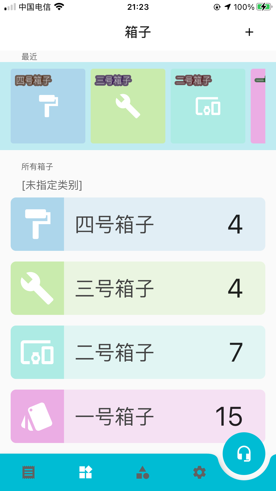

## storage for your home
# CStore

### Fetures
- Make your home clear and tidy
- Save your time for recording of items
- Use voice recognization replace of keyborad typing
- Find location of your items in easy way

### Link to me
Email: wangyuanou@foxmail.com

### License
This is a personal software made by Daniel Wang. Source code and copyright belongs to Daniel Wang.

Copyright of third partys likes programming tools, libraries, IDE belongs of themself, including Flutter, Dart, XCode, Android Studio, Baidu Voice and so on.

